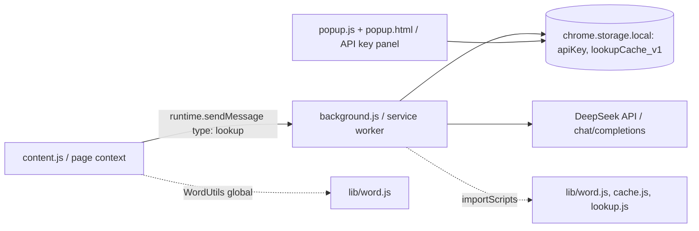

# Repository Guidelines

## Project Overview

Chrome Manifest V3 extension **DeepSeek 单词翻译** (`manifest.json`): double-click an English word on any page and a Shadow-DOM popup shows its phonetics and Chinese definitions, generated via the DeepSeek `deepseek-chat` API. The API key is managed in the extension popup. Zero-dependency, no build step.

## Architecture & Data Flow

Three JS contexts, linked through `chrome.*` APIs and shared UMD modules in `lib/`:

Lookup flow:
1. `dblclick` → `content.js` extracts the word (selection, fallback `caretRangeFromPoint`) and ±180 chars of context, shows a "查询中…" Shadow-DOM card pinned to the word.
2. `chrome.runtime.sendMessage({type:'lookup', word, context})` → `background.js` validates via `WordUtils`, truncates context to 400 chars, serves the LRU cache on hit, else POSTs `https://api.deepseek.com/chat/completions` (`deepseek-chat`, temperature 0.3, max_tokens 200, 15s AbortController timeout).
3. Reply text is JSON-parsed; result is cached and persisted to `chrome.storage.local`; the popup renders it and follows the anchor word while scrolling.

Errors are codes, not exceptions: `NO_KEY`, `AUTH` (401), `SERVER` (429/≥500), `HTTP` (other), `NETWORK` (fetch throw), `PARSE`, `INVALID`.

## Key Directories

| Path | Purpose |
|---|---|
| `lib/` | Shared UMD modules (browser global + CommonJS): `word.js` validation, `cache.js` LRU cache, `lookup.js` prompt/request/parse |
| `tests/` | `node:test` unit tests, one file per lib module |
| `e2e/` | Manual e2e harness: `serve.js` static server, `test-page.html` fixture, `e2e-happy.png` recorded evidence |
| `docs/superpowers/` | Chinese design spec (`specs/`) and implementation plan (`plans/`) — authoritative on conventions and decisions |

Root: `content.js`, `background.js`, `popup.js`, `popup.html`, `manifest.json`.

## Development Commands

No `package.json`, no build step, no lint config. Everything is plain scripts:

- Unit tests: `node --test` (default discovery finds `tests/*.test.js`; the `node --test tests/` directory form does not work on this setup)
- Syntax check: `node --check <file.js>`
- Manifest validity: `node -e "JSON.parse(require('fs').readFileSync('manifest.json','utf8'))"`
- E2E: `node e2e/serve.js` → open `http://127.0.0.1:8123/test-page.html` in Chrome with the extension loaded unpacked
- Load extension: `chrome://extensions` → Developer mode → "Load unpacked" → repo root

## Code Conventions & Common Patterns

- **No ES modules in browser code.** `lib/*.js` are UMD IIFEs: they attach to `globalThis` (`WordUtils`, `Cache`, `Lookup`) AND set `module.exports` (for Node tests). `background.js` loads them with `importScripts('lib/word.js','lib/cache.js','lib/lookup.js')`.
- **Load order matters.** `manifest.json` lists `lib/word.js` before `content.js` in `content_scripts.js`; `content.js` uses the `WordUtils` global with no import statement. Double-injection guard: `window.__dswtInjected`.
- **Naming:** camelCase functions/variables, UPPER_SNAKE constants (`API_URL`, `CACHE_CAPACITY` = 500, `TIMEOUT_MS` = 15000). Chinese user-facing strings and Chinese test names; English git commit messages.
- **Async:** promise-style `chrome.*` APIs with `async`/`await`; the message listener uses async `sendResponse` + `return true`.
- **Error handling:** return result objects `{ok:true, data}` / `{ok:false, error:'CODE'}`; map failures to codes, throw only for programmer errors (e.g. invalid cache capacity).
- **Dependency injection for testability:** `createLookup(deps)` takes `{getApiKey, requestJson, cache, makeKey}`; tests inject doubles.
- **State/storage:** `chrome.storage.local` only, keys `apiKey` and versioned `lookupCache_v1` (persisted as `entries()` array-of-pairs, shape-validated on service-worker startup). Keep `lib/` free of `chrome.*` references.

## Important Files

- `manifest.json` — MV3; `permissions: ["storage"]`, `host_permissions: https://api.deepseek.com/*`, classic (non-module) `service_worker: background.js`
- `content.js` — content script: word/context extraction, Shadow-DOM popup, messaging
- `background.js` — service worker: validation, cache, DeepSeek request, persistence
- `lib/lookup.js` — prompt building, `fnv1a` context hash, `parseLookupResponse`, `createLookup` DI factory
- `lib/cache.js` — `LRUCache` (Map-backed; `get` refreshes recency, `entries()` used for persistence)
- `lib/word.js` — `WordUtils`: `WORD_RE /^[A-Za-z][A-Za-z'-]*$/`, `MAX_LEN` 50
- `docs/superpowers/specs/2026-08-20-deepseek-word-translator-design.md` — approved design, decision tables, YAGNI list, revision history; read before changing behavior
- `docs/superpowers/plans/2026-08-20-deepseek-word-translator.md` — task-by-task plan with TDD steps; note: it still references `test/` paths while the repo actually uses `e2e/`

## Runtime/Tooling Preferences

- **Browser:** Chrome MV3, classic scripts (no `type="module"`), hand-written plain JS — no bundler, transpiler, or build step
- **Node** for tests/e2e only: CommonJS `require` with explicit `.js` extension; no pinned Node version
- **No package manager, lockfile, or `node_modules`** — zero runtime dependencies is a design constraint; adding one needs strong justification
- No linter, formatter, CI, or `.gitignore` — match the existing style by eye
- Git: single branch `main`, local-only (no remote); Conventional Commit English prefixes `feat:` / `fix:` / `test:` / `docs:`

## Testing & QA

- **Framework:** Node built-in `node:test` + `node:assert`; flat top-level `test('中文描述', async () => {...})` — no `describe`/`it`, no config file
- **Location/naming:** `tests/<module>.test.js`, one per lib module; fixtures are module-level consts
- **Mocking:** dependency injection via a `baseDeps(over)` factory in `tests/lookup.test.js`; spies are closure flags (`let called = false`); no `chrome.*` stubs exist — that's why lib/ must stay chrome-free
- **Coverage:** none configured
- **E2E:** manual — `node e2e/serve.js`, load the extension unpacked, double-click English words (`serendipity`, `ubiquitous`, `meticulous`) → popup appears; double-click Chinese text → must NOT trigger; record evidence as `e2e/e2e-happy.png`
- **Pre-commit checks (from the plan):** unit tests, `node --check`, manifest JSON parse, `git grep -n -i "sk-"` for leaked API keys
